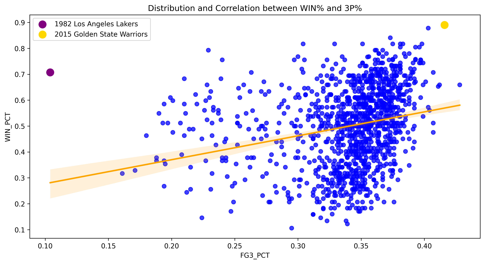
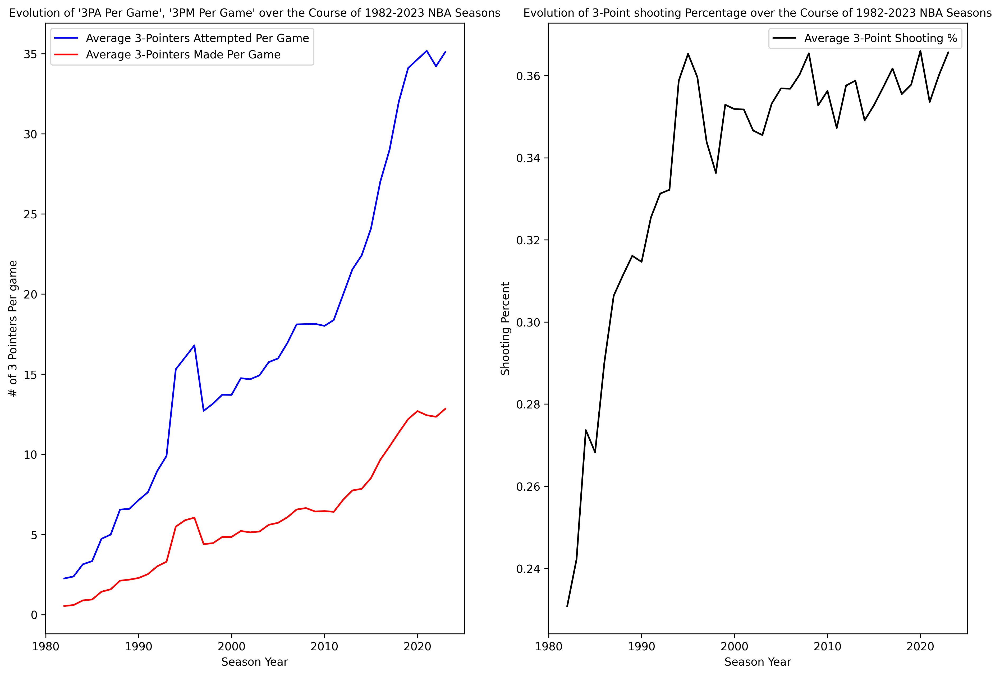

# The Three-Point Effect: How NBA Three-Point Shooting Relates to Winning

## Overview
This project analyzes historical NBA team-level data to examine the relationship between three-point shooting and team success. The goal is to understand whether teams that shoot more threes, make more threes, or shoot a higher three-point percentage tend to win more games.

## Research Question
How strongly are NBA teams’ three-point shooting statistics related to winning percentage?

More specifically, the project explores whether three-point percentage, three-point makes per game, and three-point attempts per game are useful indicators of team success across NBA seasons.

## Data
The data was collected using the `nba_api` Python package, specifically the `TeamYearByYearStats` endpoint. The dataset contains year-over-year team statistics for NBA franchises, including wins, losses, win percentage, three-point makes, three-point attempts, and three-point percentage.

Because NBA franchise names and locations have changed over time, the data required cleaning and standardization. Historical team names such as the Charlotte Bobcats, New Orleans Hornets, Seattle SuperSonics, and New Jersey Nets were mapped to their current franchise names or locations where appropriate.

One limitation is that the data comes from the NBA Stats API, which can be slow or occasionally timeout. To make the collection process more reliable, the notebook uses request headers, longer timeouts, retry logic, and local CSV outputs.

## Methods
The project uses Python for data collection, cleaning, visualization, and analysis. After retrieving team-level year-over-year data, the notebook calculates per-game three-point statistics and standardizes team names across franchise changes.

The analysis includes:
- Data cleaning and franchise-name standardization
- Feature creation for three-point makes per game and attempts per game
- Correlation analysis between win percentage and three-point shooting variables
- Scatterplots with regression lines to visualize relationships
- Outlier identification for notable teams such as the 1982 Los Angeles Lakers and 2015 Golden State Warriors
- Linear regression modeling to evaluate how well three-point shooting metrics explain variation in win percentage

## Results
The analysis found a positive relationship between three-point shooting and team success, especially when looking at three-point percentage. Teams that shot better from three-point range tended to have higher win percentages.

The visualizations also show that the relationship is not perfect. Some teams, such as the 1982 Los Angeles Lakers, achieved a high win percentage despite very low three-point usage, reflecting how different the NBA was in earlier eras. On the other hand, the 2015 Golden State Warriors stand out as a modern example of a highly successful team built around strong three-point shooting.

Overall, the project suggests that three-point shooting is meaningfully related to winning, but it is not the only factor that determines team success.

## Key Visualizations

### Growth of Three-Point Shooting Over Time


This visualization shows how three-point usage has increased across NBA seasons. Both three-point attempts per game and makes per game rise sharply over time, especially in the modern NBA, while league-wide three-point percentage improves earlier and then becomes more stable.

### Three-Point Percentage and Winning Percentage


This scatterplot shows the relationship between team three-point percentage and win percentage. The highlighted outliers help show how team success can look different across eras: the 1982 Los Angeles Lakers won at a high rate despite very low three-point usage, while the 2015 Golden State Warriors represent a modern high-volume, high-efficiency three-point team.

## Repository Structure
```text
.
├── Fulk_Proj_FinalReport.ipynb
├── data/
│   ├── allteams_year_over_year.csv
│   ├── hornets_teamyearbyyear.csv
│   ├── failed_teamyearbyyear_requests.csv
│   └── nba_teamyearbyyear_cache/
├── README.md
```
The notebook uses project-relative file paths, so the data paths should not need to be manually changed as long as the repository structure stays the same. If the project is cloned, moved, or forked, the notebook will reference the local project folder and write outputs to the `data/` directory automatically.